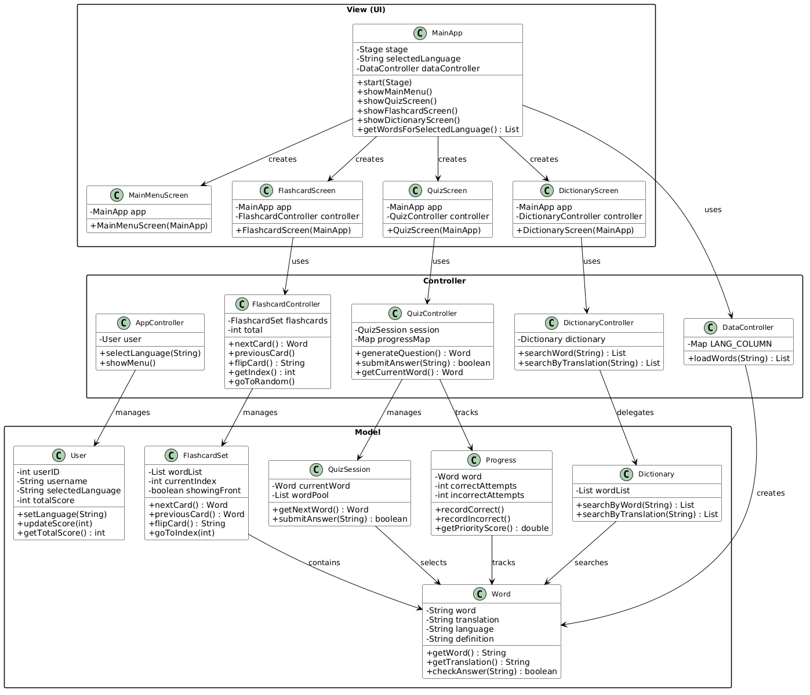
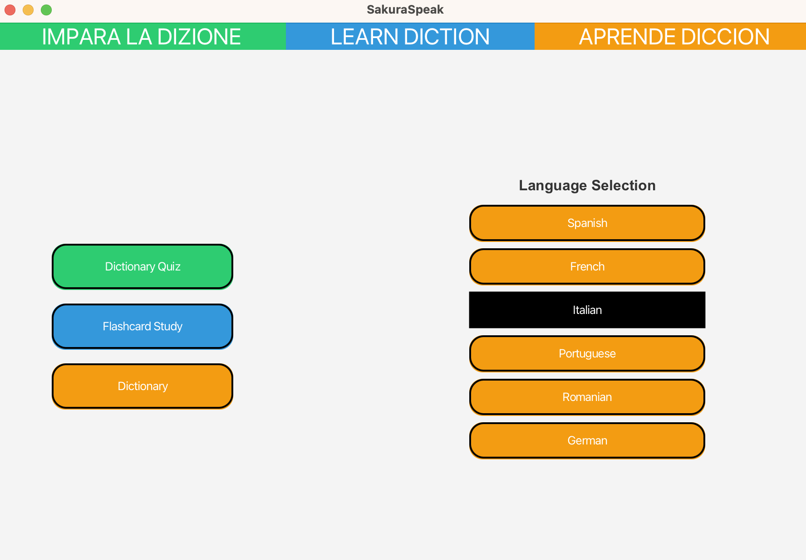
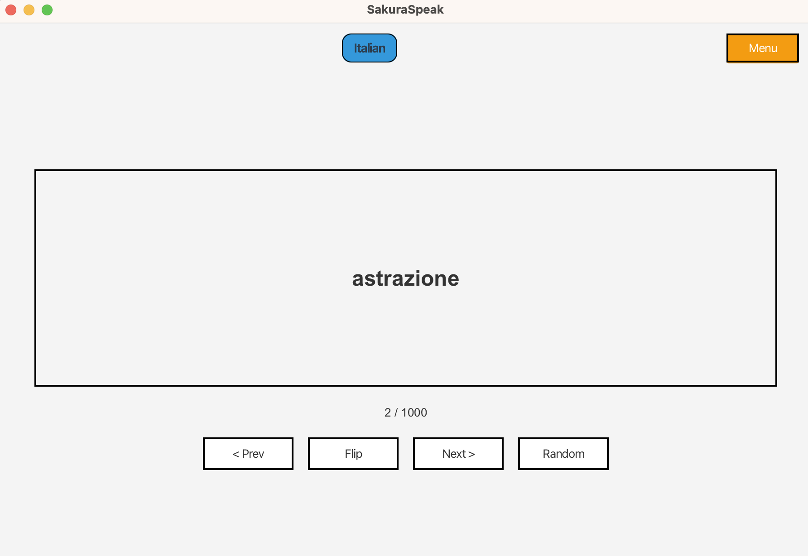
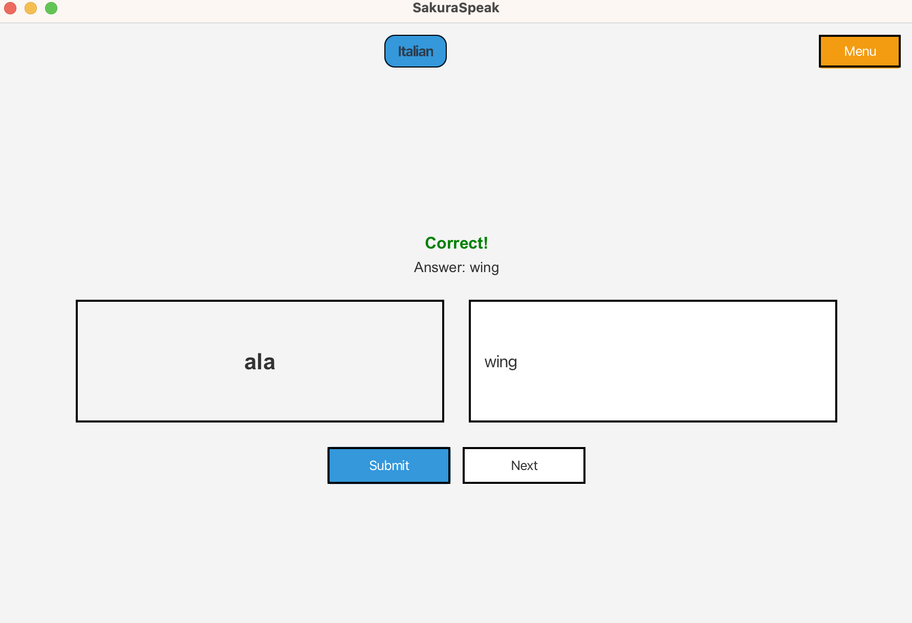
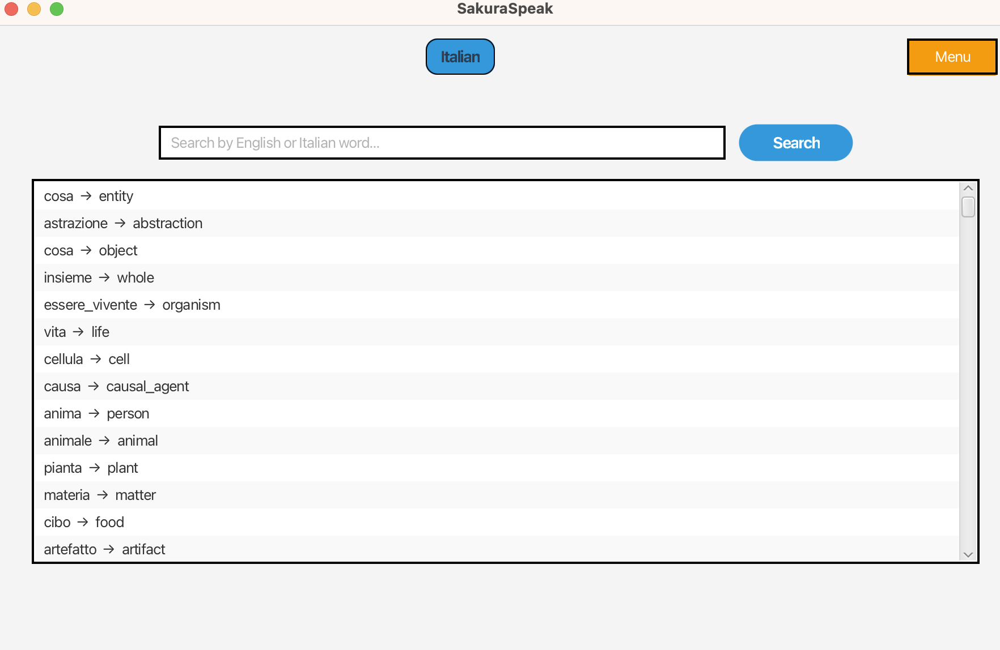

# SakuraSpeak

A JavaFX desktop application for learning vocabulary in six European languages through flashcards, quizzes, and a bilingual dictionary.

## Contributors

- Aaron I Garza
- Aastha Khadka
- Dominic Hyllis Miller
- Benjamin Osareme Ononose

---

## Features

- **Flashcard Study** — Browse word cards one at a time, flip between the foreign word and its English translation, jump to a random card, or step forward/back through the deck.
- **Dictionary Quiz** — Practice translating foreign words to English with instant feedback. Correct answers are shown after each attempt.
- **Dictionary** — Search the full word list by either the foreign word or its English translation with live filtering as you type.
- **Language Selection** — Switch between Spanish, French, Italian, Portuguese, Romanian, and German without restarting the app.

---

## Prerequisites

| Requirement | Version |
|-------------|---------|
| Java JDK    | 21+     |
| Maven       | 3.8+    |

> JavaFX is bundled as a Maven dependency — no separate JavaFX SDK installation is required.

---

## Running the App

### Maven (recommended)

```bash
mvn clean compile
mvn javafx:run
```

> **Note:** Because JavaFX requires module path configuration, launching the plain JAR with `java -jar` requires additional `--module-path` and `--add-modules` flags. Using `mvn javafx:run` handles this automatically.
 Go to Edit configuration -> Modify -> Add VM Options -> --module-path "/path/to/your/javafx-sdk/lib" --add-modules javafx.controls,javafx.fxml (replace with your local JavaFX SDK path)
---

## Project Structure

```
SakuraSpeak/
├── pom.xml                         # Maven build config (Java 21, JavaFX 21)
└── src/main/
    ├── java/
    │   ├── ui/
    │   │   ├── MainApp.java         # JavaFX Application entry point; owns the Stage
    │   │   ├── MainMenuScreen.java  # Language selector + navigation hub
    │   │   ├── FlashcardScreen.java # Flashcard study view
    │   │   ├── QuizScreen.java      # Translation quiz view
    │   │   └── DictionaryScreen.java# Searchable word list view
    │   ├── controller/
    │   │   ├── AppController.java   # Top-level app state (user + language)
    │   │   ├── DataController.java  # CSV loader — maps language names to columns
    │   │   ├── FlashcardController.java
    │   │   ├── QuizController.java
    │   │   └── DictionaryController.java
    │   └── model/
    │       ├── Word.java            # Core data unit: foreign word + translation + definition
    │       ├── FlashcardSet.java    # Ordered deck with next/prev/random navigation
    │       ├── QuizSession.java     # Random word selection for quiz rounds
    │       ├── Progress.java        # Per-word correct/incorrect attempt tracking
    │       ├── Dictionary.java      # Substring search over the word list
    │       └── User.java            # User identity and score (for future persistence)
    └── resources/
        └── data/
            └── direct_translations.csv  # Pipe-delimited word data for all languages
```

---

## Data Format

Words are stored in `direct_translations.csv` using `|` as the delimiter:

```
index | definition | English | Spanish | French | Italian | Portuguese | Romanian | German
```

Column indices used by `DataController`:

| Language   | Column |
|------------|--------|
| English    | 2      |
| Spanish    | 3      |
| French     | 4      |
| Italian    | 5      |
| Portuguese | 6      |
| Romanian   | 7      |
| German     | 8      |

---

## Architecture

The app follows a simple MVC pattern:

- **Model** — plain Java classes with no JavaFX dependencies.
- **Controller** — mediates between model and view; contains all business logic.
- **UI (View)** — JavaFX `BorderPane` subclasses; each screen is constructed fresh when navigated to.
- **`MainApp`** — owns the `Stage` and swaps scenes; passes itself to each screen so they can trigger navigation.

---

## UML Diagram



---

## Testing & Validation

The following scenarios verify that all core features work correctly after cloning and running the app.

### Setup
```bash
git clone <repo-url>
cd SakuraSpeakFinal
mvn javafx:run
```
The main menu window (900 × 600) should open immediately.

---

### Scenario 1 — Language Selection (Main Menu)

| Step | Action | Expected Result |
|------|--------|-----------------|
| 1 | Launch the app | Main menu opens with three navigation buttons on the left and six language buttons on the right |
| 2 | Click **Spanish** | The Spanish button turns black (selected state); all other language buttons remain their default style |
| 3 | Click **French** | French button turns black; Spanish button reverts to default |
| 4 | Click **Dictionary Quiz** _without_ selecting a language first | Nothing happens — navigation is silently blocked until a language is chosen |

---

### Scenario 2 — Flashcard Study

| Step | Action | Expected Result |
|------|--------|-----------------|
| 1 | Select a language, then click **Flashcard Study** | Flashcard screen opens; a foreign-language word is displayed on the card; counter shows `1 / N` |
| 2 | Click **Flip** | Card text switches to the English translation |
| 3 | Click **Flip** again | Card text switches back to the foreign word |
| 4 | Click **Next >** | Next card loads showing its foreign word; counter increments to `2 / N`; card resets to foreign-word side even if it was flipped |
| 5 | Click **< Prev** | Returns to the previous card; counter decrements |
| 6 | Click **Random** | Jumps to a random card; counter updates; card shows the foreign word side |
| 7 | Click **Menu** | Returns to the main menu; previously selected language remains highlighted |

---

### Scenario 3 — Dictionary Quiz

| Step | Action | Expected Result |
|------|--------|-----------------|
| 1 | Select a language, then click **Dictionary Quiz** | Quiz screen opens; a foreign-language word appears in the left box; answer field is focused and editable |
| 2 | Type the correct English translation and click **Submit** (or press **Enter**) | "Correct!" appears in green; the correct answer is shown below; the **Next** button appears; answer field becomes read-only |
| 3 | Click **Next** | A new random word loads; feedback clears; answer field is editable and focused again |
| 4 | Type a wrong answer and click **Submit** | "Incorrect." appears in red; the correct answer is revealed; **Next** button appears |
| 5 | Leave the answer field empty and click **Submit** | Nothing happens — empty submissions are ignored |
| 6 | Click **Menu** | Returns to the main menu |

---

### Scenario 4 — Dictionary Search

| Step | Action | Expected Result |
|------|--------|-----------------|
| 1 | Select a language, then click **Dictionary** | Dictionary screen opens; full word list is displayed (foreign word → English translation for each entry) |
| 2 | Type a few letters of a foreign word into the search bar | Results filter live with every keystroke, showing only matching words |
| 3 | Type a few letters of an English word | Results update to show entries whose English translation matches |
| 4 | Click any row in the results list | A detail panel appears below showing: `foreignWord → englishWord` and the full English definition |
| 5 | Clear the search field | Full word list is restored |
| 6 | Click **Menu** | Returns to the main menu |

---

### Scenario 5 — Language Switching

| Step | Action | Expected Result |
|------|--------|-----------------|
| 1 | Select **Spanish**, open Flashcards, note the word displayed | Spanish vocabulary is shown |
| 2 | Click **Menu**, select **German**, open Flashcards again | German vocabulary is now shown; card counter resets to `1 / N` |

---

## Screenshots

> **To add screenshots:** run the app, take a screenshot of each screen, save them to `docs/screenshots/`, and replace the placeholders below.

### Main Menu


### Flashcard Study


### Dictionary Quiz


### Dictionary

